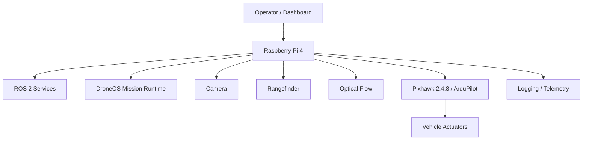

# Deployment Architecture

## Purpose

This document describes the deployment architecture for DroneOS. It defines the runtime topology, host responsibilities, and communication boundaries between the onboard companion computer, flight controller, sensors, and operator-facing interfaces.

## Scope

This document covers:

- The physical and logical deployment topology of DroneOS.
- The responsibilities of the onboard computer and peripheral devices.
- The role of logging, telemetry, and operational monitoring in deployment.
- The distinction between development, simulation, and field deployment environments.

## Design Rationale

DroneOS must run on a real embedded platform with limited compute resources, strict safety expectations, and operational constraints. The deployment architecture therefore focuses on:

- Clear separation of responsibilities between the flight controller and companion computer.
- Minimal coupling between the runtime and external hardware interfaces.
- Support for both field deployment and simulation-based testing.
- Traceable telemetry and diagnostics for operators and maintainers.

## Deployment Topology

### Onboard Runtime

The primary runtime executes on the Raspberry Pi 4 Model B running Ubuntu Server 24.04 LTS. The onboard software stack includes:

- ROS 2 Jazzy middleware.
- DroneOS application services.
- Mission plugins.
- Sensor drivers and hardware abstractions.
- Diagnostics and logging services.

### Flight Controller

The Pixhawk 2.4.8 flight controller runs ArduPilot firmware. It performs low-level stabilization and control. The companion computer sends high-level commands through MAVLink via MAVSDK.

### Sensors

The following devices are connected to the onboard system:

- Raspberry Pi Camera Module.
- TFMini-S rangefinder.
- Holybro PMW3901 optical flow sensor.

These sensors are accessed through the Hardware Abstraction Layer and normalized into platform-level messages.

### Operator Interface

The operator interface may be provided through a dashboard or ground-station connection. It receives telemetry, health updates, and mission status while enabling manual oversight and intervention where permitted.

## Runtime Allocation

| Component | Host | Responsibility |
| --- | --- | --- |
| DroneOS runtime | Raspberry Pi 4 | Mission logic, perception, navigation, safety orchestration |
| Flight controller firmware | Pixhawk 2.4.8 | Stabilization, attitude control, telemetry generation |
| Camera driver | Raspberry Pi 4 | Image acquisition and preprocessing |
| Rangefinder driver | Raspberry Pi 4 | Distance measurement handling |
| Optical flow driver | Raspberry Pi 4 | Motion estimate handling |
| Dashboard | Ground station or onboard terminal | Operator visibility and manual control |

## Communication Paths

The deployment architecture relies on the following communication channels:

- UART for sensor interfaces where required.
- MAVLink and MAVSDK for flight controller interaction.
- ROS 2 topics, services, and actions for software component communication.
- Logging and telemetry export to local or remote sinks.

## Deployment Environments

### Development Environment

Used by engineers to build, test, and validate software components in a controlled setting. It may include simulation and local development tools.

### Simulation Environment

Used for software-in-the-loop and hardware-in-the-loop testing. Simulation provides a repeatable environment for validating mission logic and safety behavior.

### Field Deployment Environment

Used for real-world flight operations. It requires validated configuration, operator oversight, and robust logging and diagnostics.

## Operational Concerns

### Reliability

The deployment must preserve service continuity even when a subsystem degrades. Safety features must remain available even if the mission system encounters a fault.

### Security

The deployment should use secure access controls for any operator interface or external telemetry connection. Mission and configuration files should be protected from unauthorized modification.

### Maintainability

The deployment topology must be straightforward enough that engineers can inspect, update, and troubleshoot the system without ambiguity.

## Mermaid Diagram

## Assumptions

- The onboard computer can run Ubuntu Server 24.04 LTS and ROS 2 Jazzy.
- The flight controller can be controlled through MAVLink and MAVSDK.
- Field deployment will be supported by operators following documented procedures.

## Limitations

- The deployment architecture is focused on a single-vehicle, onboard-computer topology.
- It does not yet define a full remote fleet management architecture.

## Future Extensions

- Remote mission control and telemetry relay.
- Cloud or edge-based analytics integration.
- Multi-vehicle deployment and synchronization.

## Conclusion

The deployment architecture assigns each responsibility to the appropriate runtime host and communication path. This ensures that the system remains modular, observable, and suitable for both simulation-based development and real-world autonomous operation.
