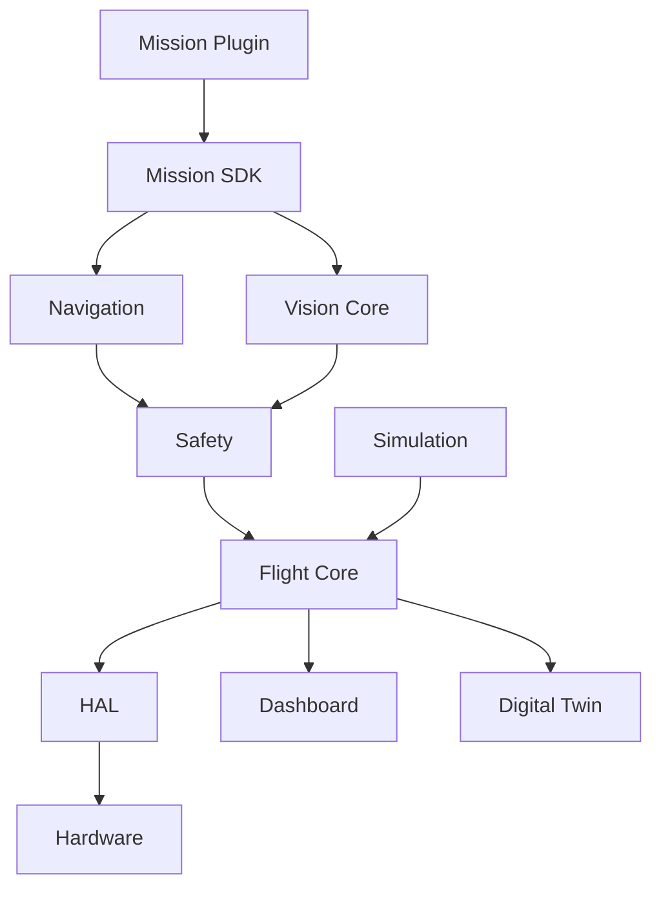

# High-Level Architecture

## Purpose

This document defines the high-level architecture of DroneOS as a modular autonomous drone operating system. It establishes the structural decomposition of the platform into reusable services, mission-specific capabilities, safety mechanisms, and external hardware interfaces. The design is intended to support the initial GPS-denied QR precision landing mission while remaining extensible to future missions such as AI target following, inspection, mapping, delivery, swarm coordination, and SLAM navigation.

## Scope

This document covers:

- The major architectural layers of DroneOS.
- The principal subsystems and their responsibilities.
- The interaction model among software components, hardware devices, and external systems.
- The architectural approach to mission extensibility and hardware abstraction.

This document does not define implementation-level code structure, low-level driver behavior, or deployment details beyond the architectural topology.

## Design Rationale

DroneOS is designed as a layered, mission-agnostic platform rather than a monolithic flight application. This separation is necessary for several reasons:

1. Mission independence: future missions should be introduced through plugins rather than by modifying the core runtime.
2. Hardware portability: the platform must support alternative sensors and flight controllers without rewriting core logic.
3. Safety isolation: critical safety functions must be explicitly separated from mission logic.
4. Maintainability: the platform must be understandable and evolvable by multiple engineers over time.
5. Testability: subsystems must be testable in simulation and in hardware-in-the-loop environments.

The architecture therefore favors explicit interfaces, dependency injection, layered separation of concerns, and a strong distinction between platform services and mission-specific logic.

## Architecture Overview

DroneOS is organized into the following major layers:

- Hardware Abstraction Layer (HAL)
- Flight Core
- Vision Core
- Navigation
- Safety
- Mission SDK
- Mission Plugins
- Dashboard
- Simulation
- Digital Twin

These layers communicate through well-defined interfaces and a shared middleware backbone based on ROS 2 Jazzy.

## DroneOS Layers

### 1. Hardware Abstraction Layer (HAL)

The HAL provides hardware-facing interfaces for sensors and actuators. It is responsible for translating platform-neutral commands into device-specific interactions while presenting a stable abstraction to the rest of the system.

Responsibilities:

- Abstracting camera, rangefinder, optical flow, and flight controller interfaces.
- Providing normalized sensor data and device health diagnostics.
- Managing registration, initialization, shutdown, and recovery of hardware components.
- Encapsulating device-specific communication protocols such as UART and MAVLink.

### 2. Flight Core

The Flight Core contains the core flight state estimation and control coordination services that support stable vehicle operation. It manages the state machine for autonomous control and provides the bridge between high-level decision-making and low-level flight control.

Responsibilities:

- Managing flight modes and state transitions.
- Receiving high-level motion commands from Navigation or Missions.
- Relaying commands to the flight controller through MAVSDK/MAVLink.
- Aggregating telemetry and status information for the platform.

### 3. Vision Core

The Vision Core handles perception tasks required by vision-guided missions. Its primary responsibility is to convert raw sensor data into structured state estimates and observations useful to the mission and navigation layers.

Responsibilities:

- Processing image streams from the camera.
- Detecting and tracking QR markers or target objects.
- Producing observation messages for downstream modules.
- Exposing calibration and diagnostic data.

### 4. Navigation

The Navigation layer provides the mapping and motion-planning services needed to support autonomous movement. It is responsible for converting perception and mission goals into safe motion references.

Responsibilities:

- Estimating position and velocity when GPS is unavailable.
- Generating trajectories and waypoints.
- Interfacing with safety constraints to ensure safe flight behavior.
- Supporting future navigation modes such as SLAM-based flight.

### 5. Safety

The Safety layer is the platform’s authority for enforcing hard constraints on vehicle behavior. It is responsible for ensuring that commands issued by mission logic, navigation, or external interfaces remain safe and valid.

Responsibilities:

- Enforcing geofencing, altitude, velocity, and attitude limits.
- Monitoring hardware health and degraded sensor states.
- Initiating fail-safe or recovery behaviors.
- Overriding unsafe commands when necessary.

### 6. Mission SDK

The Mission SDK provides reusable mission infrastructure to support the creation of mission plugins. It offers standard interfaces and services for mission lifecycle management, state reporting, telemetry integration, and shared mission behaviors.

Responsibilities:

- Defining the mission interface contract.
- Managing mission lifecycle states.
- Providing shared utility services for mission developers.
- Exposing mission-level diagnostics and status events.

### 7. Mission Plugins

Mission Plugins implement specific behaviors for individual missions. Each plugin is developed against the Mission SDK and is isolated from the core platform. Mission plugins must not modify core logic directly.

Responsibilities:

- Implementing mission-specific behavior such as QR landing logic.
- Reporting mission goals, progress, and completion conditions.
- Interacting with platform services through stable interfaces.
- Defining mission-specific configuration and safety assumptions.

### 8. Dashboard

The Dashboard provides operators and developers with visibility into system status, telemetry, mission state, health, logs, and diagnostics. It serves both runtime monitoring and post-flight analysis needs.

Responsibilities:

- Presenting live system telemetry and mission state.
- Exposing alarms, health metrics, and diagnostic information.
- Supporting manual override and operational commands where appropriate.
- Aggregating logs and performance data.

### 9. Simulation

The Simulation layer provides a software-in-the-loop and hardware-in-the-loop environment for validation. It enables the platform to be tested without requiring immediate access to the physical drone in every stage of development.

Responsibilities:

- Simulating sensors, vehicle dynamics, and environmental conditions.
- Supporting regression and acceptance testing.
- Enabling repeated validation of mission behavior.
- Facilitating development of safety assumptions.

### 10. Digital Twin

The Digital Twin layer represents a synchronized virtual model of the vehicle and environment. It is intended to support diagnostics, replay, and validation of system behavior.

Responsibilities:

- Maintaining a current model of vehicle state and mission context.
- Supporting replay and anomaly analysis.
- Providing a reference model for comparison with live telemetry.
- Enabling future predictive diagnostics.

## Communication Model

All major layers communicate through the following mechanisms:

- ROS 2 topics for telemetry, events, and streaming data.
- ROS 2 services for synchronous requests and command acknowledgments.
- ROS 2 actions for long-running mission behavior.
- Shared configuration objects and typed interfaces.
- Diagnostics and health channels for subsystem status.

Communication is intentionally layered so that mission components depend on interfaces and platform services rather than directly on hardware implementations.

## Component Interaction

A typical runtime flow is as follows:

1. Sensors publish data through the HAL into ROS 2 topics.
2. Vision Core and Navigation consume these streams to produce state and planning outputs.
3. Safety evaluates the commands and state against safety policies.
4. Mission Plugin requests or commands are processed through the Mission SDK.
5. Flight Core translates validated commands into vehicle control messages.
6. Dashboard and Digital Twin receive telemetry and health updates for monitoring and analysis.

## Mermaid Diagram

## Responsibilities Summary

| Layer | Primary Responsibility |
| --- | --- |
| HAL | Hardware interface and sensor abstraction |
| Flight Core | Flight state and control coordination |
| Vision Core | Perception and visual observation generation |
| Navigation | Motion planning and state estimation |
| Safety | Hard safety enforcement and fail-safe behavior |
| Mission SDK | Mission development interfaces and lifecycle support |
| Mission Plugins | Mission-specific logic |
| Dashboard | Operator and developer monitoring |
| Simulation | Validation and test environment |
| Digital Twin | Virtual model and replay support |

## Assumptions

- The flight controller can be controlled through MAVLink and MAVSDK.
- The companion computer has sufficient compute resources for perception and mission processing.
- ROS 2 Jazzy provides the required message, service, and action infrastructure.
- Sensor hardware will be available in a stable and documented form during integration.

## Limitations

- This architecture assumes a single-vehicle, single-operator deployment in the initial release.
- It does not define the full communications stack for multi-drone coordination in the initial Phase 0 scope.
- It does not prescribe specific implementation frameworks beyond the architectural constraints.

## Future Extensions

- Support for multi-vehicle swarm behaviors.
- Advanced SLAM-based navigation and mapping.
- Increased autonomy through predictive planning and learned perception.
- More sophisticated health monitoring and digital-twin-based diagnostics.

## Conclusion

DroneOS is structured as a layered, modular autonomous flight platform designed for safety, maintainability, and mission extensibility. The architecture separates core flight behavior from mission-specific logic and ensures that new capabilities can be introduced without undermining the stability of the core system.
