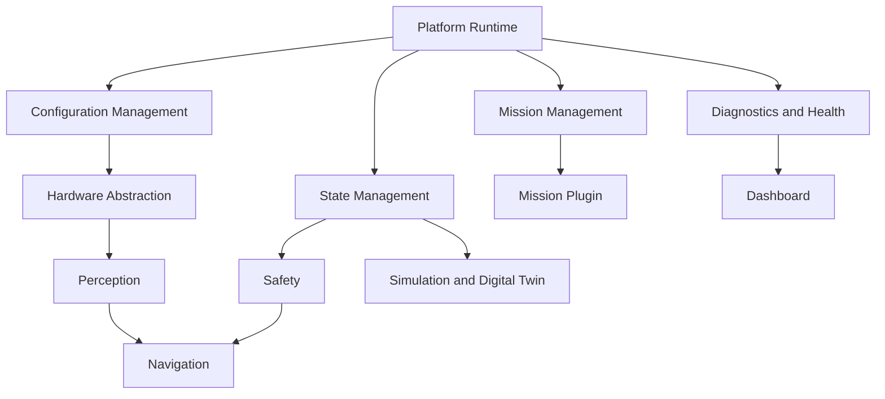

# Module Diagrams

## Purpose

This document describes the major software modules of DroneOS and their relationships. It provides a structural view of the platform that supports integration planning, subsystem ownership, and future extension without requiring implementation-specific code details.

## Scope

This document covers:

- The major modules in the DroneOS architecture.
- The responsibilities of each module.
- The dependencies and interfaces between modules.
- A conceptual view of how the platform is organized for maintainability and mission extensibility.

## Design Rationale

A robotics platform becomes difficult to maintain when modules are not clearly separated by responsibility. This document defines module boundaries in a way that supports:

- Clear ownership and code review.
- Dependency minimization.
- Replacement of hardware adapters without invasive changes.
- Separation of mission behavior from platform safety.

## Module Overview

DroneOS is divided into the following conceptual modules:

- Platform Runtime
- Configuration Management
- Diagnostics and Health
- State Management
- Hardware Abstraction
- Perception
- Navigation
- Safety
- Mission Management
- Dashboard
- Simulation and Digital Twin

## Module Definitions

### Platform Runtime

Responsibilities:

- Lifecycle management.
- Boot sequence orchestration.
- Runtime supervision.

Dependencies:

- Configuration Management
- Diagnostics and Health
- State Management

### Configuration Management

Responsibilities:

- Loading YAML configuration.
- Validating parameter values.
- Propagating configuration to runtime modules.

Dependencies:

- Platform Runtime

### Diagnostics and Health

Responsibilities:

- Health monitoring.
- Error and warning propagation.
- Runtime metrics and alarms.

Dependencies:

- State Management
- Hardware Abstraction
- Mission Management

### State Management

Responsibilities:

- Platform state tracking.
- Mission state tracking.
- Transition validation.

Dependencies:

- Configuration Management
- Diagnostics and Health

### Hardware Abstraction

Responsibilities:

- Camera interface integration.
- Rangefinder interface integration.
- Optical flow interface integration.
- Flight controller interface integration.

Dependencies:

- Configuration Management
- Diagnostics and Health

### Perception

Responsibilities:

- Visual processing.
- Marker detection and pose estimation.
- Observation generation.

Dependencies:

- Hardware Abstraction
- Configuration Management
- Diagnostics and Health

### Navigation

Responsibilities:

- Motion planning.
- Safety-aware trajectory generation.
- State estimation support.

Dependencies:

- Perception
- Safety
- State Management

### Safety

Responsibilities:

- Constraint enforcement.
- Failsafe logic.
- Health-based intervention.

Dependencies:

- State Management
- Hardware Abstraction
- Navigation

### Mission Management

Responsibilities:

- Mission plugin hosting.
- Mission lifecycle orchestration.
- Mission status reporting.

Dependencies:

- State Management
- Safety
- Configuration Management

### Dashboard

Responsibilities:

- Operator visualization.
- Monitoring and alert presentation.
- Manual interaction support.

Dependencies:

- Diagnostics and Health
- State Management
- Mission Management

### Simulation and Digital Twin

Responsibilities:

- Test environment control.
- Virtual state replay.
- Diagnostic analysis support.

Dependencies:

- Platform Runtime
- State Management
- Mission Management

## Module Dependency Diagram

## Module Interaction Patterns

### Control Flow

- Platform Runtime starts the system.
- Configuration Management supplies settings.
- State Management tracks mode and mission progress.
- Safety supervises command validity.
- Mission Management executes mission logic.
- Navigation and Perception provide the necessary state and motion updates.

### Data Flow

- Hardware Abstraction emits sensor data into the runtime.
- Perception and Navigation transform the data into semantic and motion outputs.
- Diagnostics and Health collect runtime conditions and publish them to the dashboard and logs.

## Assumptions

- Each module has a well-defined responsibility and does not directly bypass the safety layer.
- Module boundaries are stable enough to support incremental development.
- Cross-module dependencies are routed through interfaces rather than direct implementation coupling.

## Limitations

- The diagram represents a conceptual module structure and not a fixed implementation layout.
- Future mission-specific modules may introduce additional components under the Mission Management area.

## Future Extensions

- Mission-specific service modules.
- Additional planning and estimation modules.
- Deeper digital-twin integration for model-based diagnostics.

## Conclusion

The module diagram organizes DroneOS into coherent responsibilities that preserve safety, flexibility, and maintainability. The design supports a clean separation between reusable platform services and mission-specific logic.
