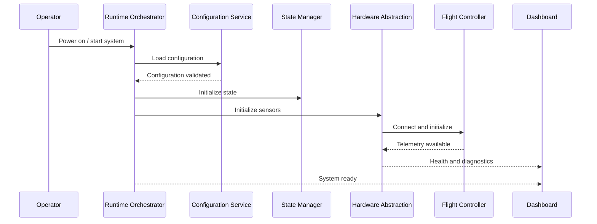
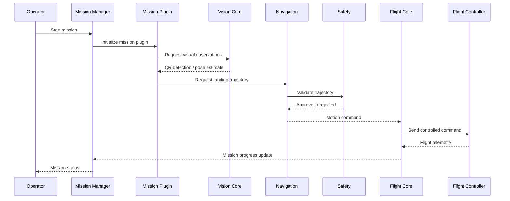
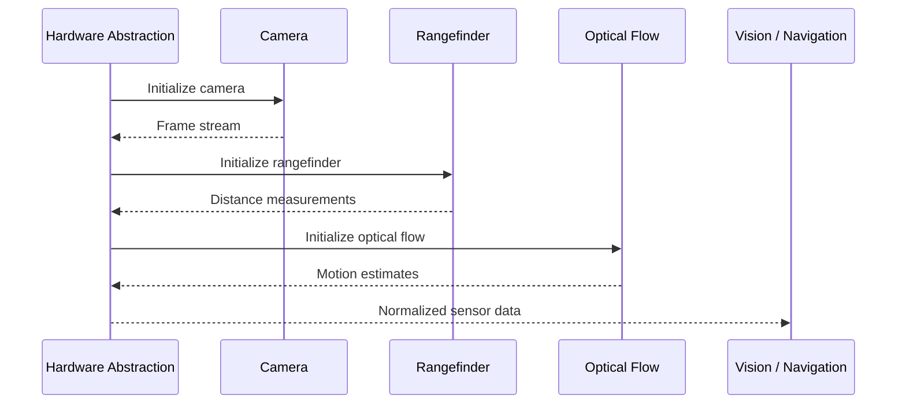
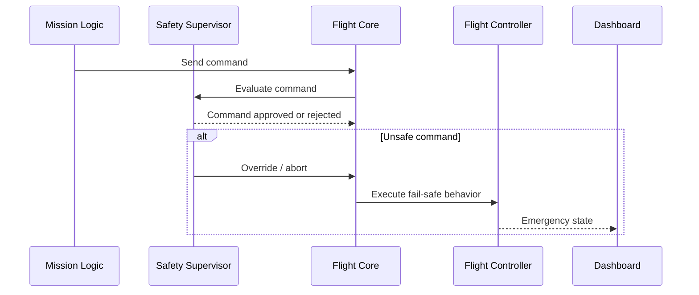
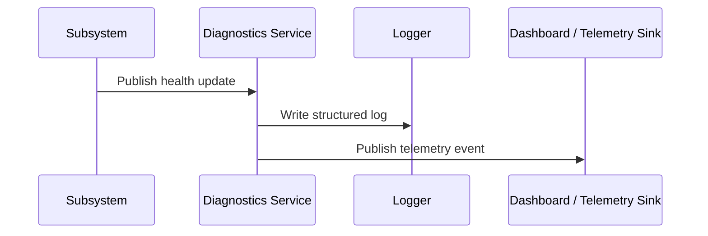

# Sequence Diagrams

## Purpose

This document describes the main runtime interaction flows within DroneOS. It captures how subsystems exchange control, commands, telemetry, and status information during startup, mission execution, and failure handling.

## Scope

This document covers:

- Boot sequence interactions.
- Mission execution flow.
- Hardware interaction flow.
- Safety intervention flow.
- Dashboard and telemetry reporting flow.

## Design Rationale

Sequence diagrams are essential for ensuring that complex robotics behaviors are understood across teams. They clarify the ordering of actions, dependencies between components, and how failure conditions are surfaced to the operator and recovery logic.

## Boot Sequence

The boot sequence describes how the system is brought from power-on into a mission-ready state.

## Mission Flow

The mission flow shows how a mission plugin interacts with platform services during the execution of the QR precision landing mission.

## Hardware Interaction

This sequence shows how hardware devices are abstracted and used within the runtime.

## Safety Intervention

The safety intervention sequence shows how unsafe behavior is contained and surfaced.

## Diagnostics and Telemetry Reporting

This sequence describes how health data is propagated through the system.

## Assumptions

- ROS 2 topic and service flows are available during runtime.
- The flight controller and companion computer remain connected.
- Safety checks are executed before critical commands are forwarded.

## Limitations

- These diagrams reflect the intended runtime flow and not every implementation-specific exception path.
- Detailed timing behavior is not prescribed in this document.

## Future Extensions

- Multi-vehicle coordination sequence diagrams.
- Recovery and replan sequences for mission failure.
- Remote operator handoff sequences.

## Conclusion

The sequence diagrams establish the expected interaction patterns across the DroneOS platform. They clarify how the system behaves during startup, mission execution, hardware access, safety intervention, and diagnostics reporting.
