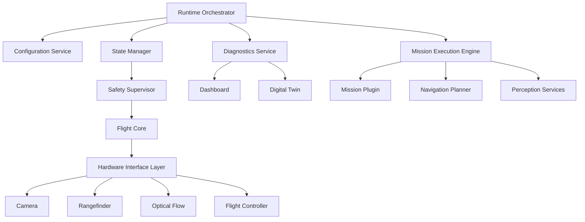

# Software Architecture

## Purpose

This document describes the internal software architecture of DroneOS in a manner suitable for long-term engineering maintenance. It defines the major software components, component responsibilities, communication patterns, and architectural constraints required to support a modular autonomous drone platform.

## Scope

This document covers:

- The internal decomposition of DroneOS into runtime components.
- ROS 2-based communication architecture.
- The interfaces between platform services, mission plugins, and hardware abstraction layers.
- The architectural approach to dependency injection, diagnostics, and configuration management.

## Design Rationale

The software architecture is based on the principle that core platform services must remain stable while mission-specific behaviors evolve. This requires:

- Strong separation between platform services and mission plugins.
- Stable interfaces that abstract hardware and runtime concerns.
- Explicit dependency injection rather than hidden global state.
- A consistent event and state model across all subsystems.
- Diagnostic and health reporting from each component.

## Architectural Style

DroneOS follows a layered service-oriented architecture with a message-driven runtime model. The platform is organized around shared runtime services, sensor and vehicle interfaces, mission orchestration, and operator-facing monitoring.

### Core Characteristics

- Event-driven telemetry propagation through ROS 2 topics.
- Request-response interactions for state queries and parameter updates.
- Action-based handling for long-running mission behavior.
- Interface-based dependency injection for hardware and mission components.
- Centralized configuration and diagnostics services.

## Major Software Components

### 1. Runtime Orchestrator

The Runtime Orchestrator owns the startup sequence, subsystem initialization, and runtime lifecycle. It coordinates the startup order of services and applies runtime configuration.

Responsibilities:

- Initializing configuration and logging systems.
- Starting platform services in a controlled order.
- Managing lifecycle transitions such as boot, standby, mission ready, mission active, and shutdown.
- Handling emergency stop and recovery transitions.

### 2. Configuration Service

The Configuration Service loads, validates, and distributes YAML configuration to all components. It ensures that every subsystem receives consistent settings and that configuration updates are traceable.

Responsibilities:

- Loading global, hardware, mission, and safety configuration.
- Validating parameter consistency before runtime startup.
- Exposing configuration to components through typed interfaces.
- Supporting runtime reconfiguration within defined safety constraints.

### 3. Diagnostics and Health Service

The Diagnostics Service exposes subsystem health, timestamps, readiness, and fault information. It supports both runtime operators and automated monitoring logic.

Responsibilities:

- Collecting health metrics from each subsystem.
- Publishing diagnostic states and alarms.
- Supporting watchdog logic and fail-safe triggers.
- Retaining metrics for logs and post-flight analysis.

### 4. State Manager

The State Manager tracks the current operating mode, mission state, vehicle state, and transition conditions. It centralizes state transitions to avoid inconsistent behavior across subsystems.

Responsibilities:

- Maintaining platform-level state such as boot, idle, armed, active mission, abort, and recovery.
- Validating transitions against system policies.
- Broadcasting state changes to other services and the dashboard.
- Supporting mission-state synchronization with the flight controller.

### 5. Hardware Interface Layer

This layer provides software abstractions for cameras, rangefinders, optical flow sensors, and the flight controller. It hides device-specific communication details behind interface contracts.

Responsibilities:

- Implementing hardware adapters for each device.
- Translating device events into normalized software messages.
- Managing initialization, calibration, error handling, and teardown.
- Reporting health and diagnostics.

### 6. Perception Services

Perception Services convert raw sensor data into meaningful observations. These services are organized around vision processing and sensor fusion functions relevant to mission behavior.

Responsibilities:

- Processing camera streams.
- Estimating target pose or marker state.
- Producing observations used by navigation or mission logic.
- Exposing confidence, error, and calibration data.

### 7. Navigation Planner

The Navigation Planner calculates safe movement behavior for the vehicle. It integrates perception, motion constraints, and mission goals into trajectories or motion references.

Responsibilities:

- Producing motion commands and trajectories.
- Respecting dynamic safety limits and environmental constraints.
- Coordinating with localization or odometry services where available.
- Interfacing with the Safety layer for validation.

### 8. Mission Execution Engine

The Mission Execution Engine manages mission lifecycle execution. It hosts mission plugins, tracks mission progress, and coordinates mission-specific services with platform-level capabilities.

Responsibilities:

- Instantiating and managing mission plugins.
- Tracking mission progress and state transitions.
- Handling mission abort, pause, resume, and completion.
- Enforcing plugin contracts and lifecycle boundaries.

### 9. Safety Supervisor

The Safety Supervisor is a critical runtime authority responsible for preserving safe vehicle behavior under all conditions. It is separate from mission logic and must remain available even if mission plugins fail.

Responsibilities:

- Evaluating safety constraints.
- Rejecting unsafe commands.
- Transitioning the system into a safe state when anomalies are detected.
- Coordinating with the flight controller and mission manager.

### 10. Dashboard and Operator Interface

The dashboard subsystem provides operator visibility into the system and supports manual decision-making. It consumes telemetry and health data rather than directly controlling flight behavior except when explicitly permitted.

Responsibilities:

- Displaying live state and mission progress.
- Reporting alarms and system health.
- Providing manual controls within approved safety boundaries.
- Supporting operator inspection and analysis.

## Component Communication Model

### ROS 2 Topics

ROS 2 topics are the primary communication channel for low-latency and streaming data:

- Sensor streams from cameras, rangefinders, and flow sensors.
- Vehicle telemetry from the flight controller.
- State and health events from platform services.
- Mission progress and event notifications.

### ROS 2 Services

ROS 2 services are used for synchronous, transactional operations:

- Parameter retrieval and updates.
- Calibration requests.
- Mission initialization requests.
- Health and readiness checks.

### ROS 2 Actions

ROS 2 actions are used for long-running mission operations:

- Landing execution.
- Follow-target behavior.
- Inspection survey tasks.
- Return-to-home and abort sequences.

## Dependency Injection Strategy

DroneOS uses dependency injection to decouple components from concrete implementations. This is required because hardware implementations may differ across prototypes, test environments, and final deployments.

### Principles

- Components receive interfaces, not concrete device implementations.
- Configurable factories instantiate runtime implementations.
- Mission plugins depend on platform abstractions rather than global singletons.
- Tests can substitute simulated implementations without changing the core logic.

## Configuration and Runtime Model

All runtime components should be configured through a YAML-driven configuration system. Configuration is loaded centrally and passed to components using dependency injection. The system must support:

- Global defaults.
- Hardware-specific overrides.
- Mission-specific configuration.
- Safety constraints and tunables.

## Diagnostics and Observability

Every component is expected to expose:

- Health state.
- Timestamped lifecycle events.
- Error and warning conditions.
- Performance metrics where relevant.
- Configuration provenance.

These diagnostics feed the central logging, telemetry, and dashboard systems.

## Mermaid Diagram

## Assumptions

- ROS 2 Jazzy provides sufficient support for the intended message, service, and action model.
- The companion computer can host perception and mission processing workloads alongside middleware services.
- The flight controller can be commanded through MAVLink and MAVSDK in a predictable manner.

## Limitations

- This architecture assumes a single-vehicle runtime for Phase 0.
- Mission plugins are expected to be bounded by explicit interfaces and safety checks.
- Full distributed deployment and fleet coordination are explicitly deferred to future phases.

## Future Extensions

- Multi-vehicle mission orchestration.
- Plug-in marketplace or versioned mission packages.
- Advanced state-estimation and sensor-fusion services.
- More sophisticated predictive diagnostics and digital-twin integration.

## Conclusion

DroneOS software architecture is intentionally layered and service-oriented. It separates mission logic from platform safety, exposes stable interfaces across hardware and software boundaries, and ensures that mission extensibility does not compromise the core system’s reliability or maintainability.
