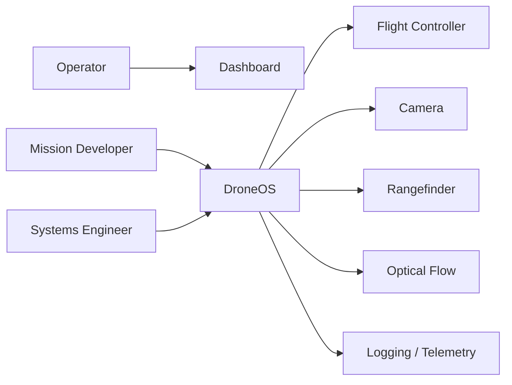

# System Context

## Purpose

This document describes the external context in which DroneOS operates. It defines the principal actors, environmental assumptions, interfaces, and operational dependencies that influence the design of the platform.

## Scope

This document covers:

- External actors that interact with DroneOS.
- Hardware and software systems that DroneOS depends on.
- Operational and environmental constraints relevant to mission behavior.
- The relationship between DroneOS and the physical drone platform.

## Design Rationale

A robotics system is shaped as much by its operational context as by its internal architecture. DroneOS must be designed for a real-world environment where sensor quality, communication reliability, power availability, and safety constraints influence runtime behavior. The system context therefore defines the boundaries within which the software architecture must remain robust and predictable.

## System Actors

### 1. Operator

The operator is responsible for monitoring the system, initiating missions, and responding to anomalies. The operator interacts with the platform through the dashboard and manual override capabilities where permitted.

Responsibilities:

- Starting and stopping missions.
- Monitoring telemetry and alarms.
- Triggering manual intervention when necessary.

### 2. Mission Developer

The mission developer creates mission plugins and configures mission-specific behavior. The mission developer operates within the Mission SDK and is expected to respect platform safety and interface contracts.

Responsibilities:

- Implementing mission logic.
- Writing mission tests.
- Defining mission-specific configuration and constraints.

### 3. Systems Engineer

The systems engineer is responsible for integration, calibration, deployment, and long-term maintenance of the platform. This role ensures that the platform remains reliable across hardware revisions and environment changes.

Responsibilities:

- Integrating hardware and software components.
- Maintaining system configuration and calibration data.
- Supporting troubleshooting and field diagnostics.

### 4. Flight Controller

The flight controller acts as the low-level autopilot and actuator interface. It accepts high-level commands from the companion computer and executes them using firmware provided by ArduPilot.

Responsibilities:

- Executing attitude, position, and velocity control.
- Reporting telemetry and state.
- Handling low-level flight stabilization.

### 5. Companion Computer

The companion computer hosts the DroneOS runtime, mission logic, perception processes, and connectivity with the flight controller and sensors.

Responsibilities:

- Running the ROS 2-based software stack.
- Processing sensor data and mission logic.
- Coordinating safety and control commands.

## External Systems

### Camera

The camera provides visual input for the initial landing mission and future perception-based tasks. It is connected to the Raspberry Pi 4 and accessed through the camera interface abstraction.

### Rangefinder

The rangefinder provides distance measurements used to support landing or obstacle detection behavior.

### Optical Flow Sensor

The optical flow sensor provides motion-related measurements that can support state estimation and localization under constrained conditions.

### MAVLink / MAVSDK

The platform uses MAVLink and MAVSDK as the primary communication pathway with the flight controller.

### Dashboard

The dashboard provides telemetry and operator interaction. It may run locally or on a connected ground station depending on deployment needs.

## Environmental Context

DroneOS operates in environments that may include:

- Indoor or GPS-degraded environments.
- Variable lighting conditions.
- Moving objects or reflective surfaces.
- Limited communication bandwidth or intermittent telemetry links.
- Constrained physical space for landing and inspection tasks.

These conditions directly influence safety margins, perception quality, and mission behavior.

## System Boundaries

DroneOS is responsible for:

- Mission execution.
- Sensor acquisition and processing.
- Flight command coordination.
- Safety enforcement.
- Diagnostics and logging.

DroneOS is not responsible for:

- Low-level sensor hardware manufacturing.
- Vehicle propulsion or actuator design.
- Flight controller firmware development beyond integration and configuration.
- External network infrastructure beyond the supported deployment environment.

## Interaction Model

The platform receives input from sensors and operator commands. It produces:

- Vehicle motion commands.
- Mission updates and status.
- Health and diagnostic information.
- Logs and telemetry for monitoring.

The interaction model is structured so that all external effects are governed by platform-level safety constraints and mission interfaces.

## Assumptions

- The drone will operate in a controlled but nontrivial environment.
- The companion computer and flight controller will remain connected and synchronized during runtime.
- Sensor data will be available in a reliable enough form for the initial mission objectives.
- Operators and developers will follow documented procedures for startup, shutdown, and supervised operation.

## Limitations

- Real-time performance may vary with computational load and sensor throughput.
- Environmental conditions may reduce perception quality and mission success probability.
- Some interactions with the physical vehicle are constrained by safety rules and hardware limits.

## Future Extensions

- Integration with additional external systems such as ground stations or remote command interfaces.
- Broader operational domains including outdoor and swarm scenarios.
- More advanced mission-specific telemetry and analytics pipelines.

## Mermaid Diagram

## Conclusion

The DroneOS system context defines the environment, actors, and constraints that shape the architecture. The platform must be designed not only as a software system but as a dependable embedded autonomy stack operating within a safety-critical and resource-constrained physical context.
